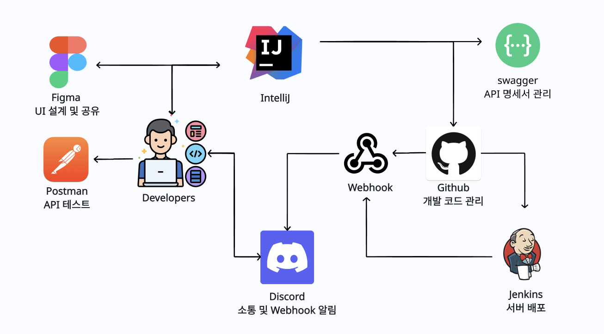
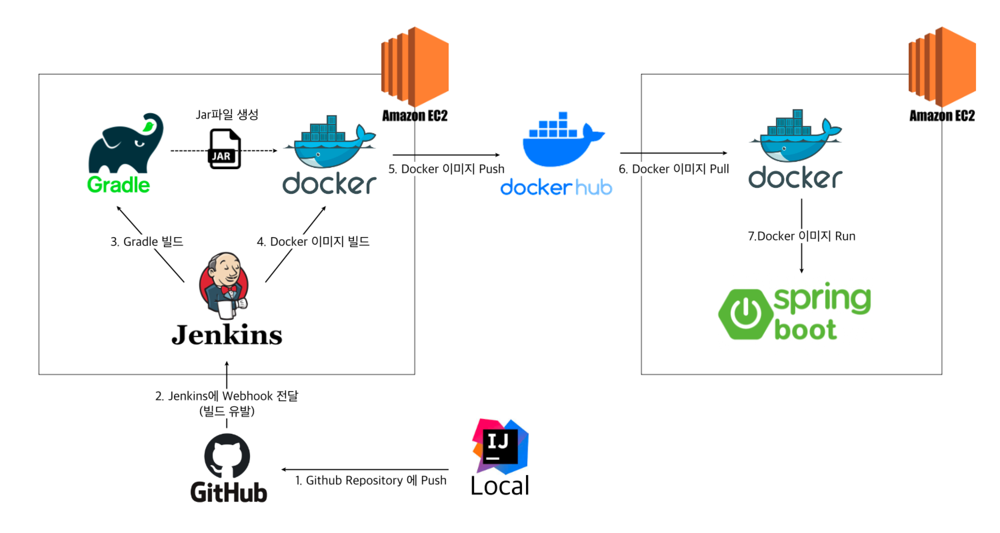

# 🔑 취업 성공의 치트키, 취트키!

      

# 문석범's 수행역할 및 배운점

## 크롤링 추가서버
https://github.com/ChwitKey/CherryPickCrawling  

## 크롤링서버 구조

## 크롤링서버 GitHub Actions을 사용한 cicd를 구현

## 프로젝트의 아키텍처를 생각하며 성능이슈도 생각
서버 분리를 통해 메인 서버의 부하를 감소시키고, 각 서버의 성능을 최적화하여 시스템의 효율성과 안정성을 크게 향상시켰습니다. 이 결정은 더욱 빠른 대응과 확장성 증대를 가능하게 하여, 크롤링과 메인 작업의 분리로 전체적인 서비스 운영을 개선했습니다. 모노리틱 크롤링 서버의 성능 문제를 인식하고, 서버를 분할하여 MSA와 같은 분산 아키텍처를 공부하게 되는 계기가 되었습니다.  

## java를 사용하여 크롤링을 구현

## 메인서버의 유저 인증인가 개발

## 백엔드 팀장
팀장으로서 KPT 회고 방식을 통해 팀의 성과를 분석하고, 문제점을 개선하여 프로젝트의 효율성을 증대시켰습니다.  

---

# 👋 About

## 2023.07 - 2023. 08

##### 2023. 08. 22 취트키 version 1.0 Google PlayStore 출시 신청

### 협업

### 추후 지속적인 업데이트 및 리팩토링 예정 🔥

 

## *****Description*****

🔑 ･ *****관심 직군과 키워드를 설정하여 필요한 기사를 한 눈에 볼 수 있어요***** ･ 🔑
- 관심 직군을 최대 3개까지 선택!
- 관심 키워드를 최대 10개까지 선택!
- 인기순, 최신순, 오래된 순으로 정렬해서 확인해요!
- 궁금한 기사는 바로 검색할 수도 있어요!

 

🔑 ･ *****저장하고 싶은 기사는 스크랩하고, 공유해요***** ･ 🔑
- 필요한 기사는 스크랩하여 모아 볼 수 있어요!
- 공유하고 싶은 기사는 링크를 전달할 수 있어요!

 

🔑 ･ *****GPT는 내 친구! 기사 별로 GPT와의 채팅이 가능해요!***** ･ 🔑
- 내가 봤던 기사를 GPT가 요약해줘요!
- 기사에 관련된 질문이라면 얼마든지 GPT와 채팅할 수 있어요!

 
 
 

# 👤 *****Contributor*****

<table style="font-weight : bold">
      <tr>
         <td align="center">
          
          </td>
          <td align="center">
              
          </td>
          <td align="center">
              
          </td>
      </tr>
      <tr>
          <td align="center">김민기</td>
          <td align="center">문석범</td>
          <td align="center">이유정</td>
      </tr>
  </table>

 

# 📱 *****Preview*****

|                                                                    로그인                                                                     |                                                                    회원 등록                                                                     |                                                            직군별 기사 리스트                                                            |                                                            키워드별 기사 리스트                                                             |
|:----------------------------------------------------------------------------------------------------------------------------------------------:|:-----------------------------------------------------------------------------------------------------------------------------------------------:|:---------------------------------------------------------------------------------------------------------------------------:|:---------------------------------------------------------------------------------------------------------------------------:|
|               |                |  |  |

|                                                             기사 검색                                                               |                                                             기사 상세 페이지                                                              |                                                               키워드 등록                                                               |                                                            마이페이지                                                              |
|:---------------------------------------------------------------------------------------------------------------------------------:|:---------------------------------------------------------------------------------------------------------------------------------:|:---------------------------------------------------------------------------------------------------------------------------------:|:---------------------------------------------------------------------------------------------------------------------------------:|
|  |  |  |  |

|                                                              마이페이지 상세                                                               |                                                             지피티                                                              |                                                               스크랩 리스트                                                               |                                                           직군 선택                                                             |
|:---------------------------------------------------------------------------------------------------------------------------------:|:---------------------------------------------------------------------------------------------------------------------------------:|:---------------------------------------------------------------------------------------------------------------------------------:|:---------------------------------------------------------------------------------------------------------------------------------:|
|  |  |  |  |

 

# 🔎 ***Architecture***

### ALM

 
 

### CI / CD

 

# 📕 *****Convention*****

[우리의 협업 방식 ✅ Link](https://bustling-iguanodon-674.notion.site/f89ae6a682c144f7ae0b69efc670bf77)

 

# ⚒️ ***Tech***

### Backend
 
    

### DB
   

### CI/CD
   

### Deploy
 

### Develop Tool
    

 

